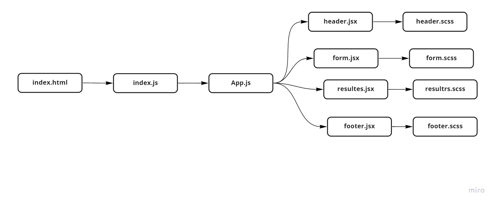

# RESTy :

## Author: Ayah Zaareer
 
## Test CI:
[URL](https://github.com/AyahZaareer/RESTy/actions)

## Deploy:
[URI](https://angry-allen-9e3553.netlify.app)

## Pull Request:
  - **pull-request#1** :[URL](https://github.com/AyahZaareer/RESTy/pull/1)
  - **pull-request#2** :[URL](https://github.com/AyahZaareer/RESTy/pull/3)
  - **pull-request#3** :[URL](https://github.com/AyahZaareer/RESTy/pull/6)
  - **pull-request#3** :[URL](https://github.com/AyahZaareer/RESTy/pull/7)

## Setup:
1. clone the repo.
2. copy starter code.
3. npm i.

## Run:
 - npm start

## Test:
 - npm test

 
